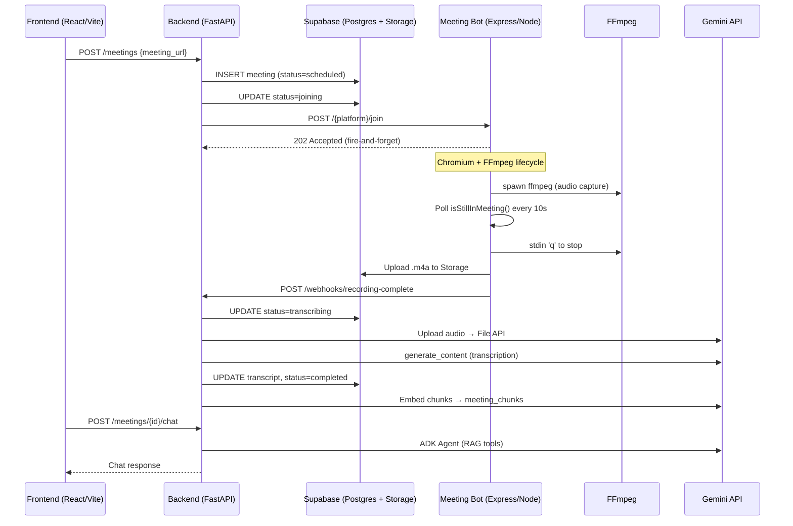

# Meeting Recorder Bot — Architecture & Vulnerability Audit

> **Auditor scope**: Every source file across `backend/`, `meeting-bot/`, `frontend/`, and `supabase/`.
> **Focus**: Concurrency vulnerabilities, memory leaks, backend performance loopholes, and inter-service interaction integrity.

---

## System Interaction Map



### Service Boundaries

| Layer | Tech | Entry Point | Runs As |
|---|---|---|---|
| **Frontend** | React + Vite | [`main.jsx`](file:///e:/meeting-recorder-bot/frontend/src/main.jsx) | SPA at `:5173` |
| **Backend** | FastAPI + Uvicorn | [`main.py`](file:///e:/meeting-recorder-bot/backend/app/main.py) | ASGI at `:8000` |
| **Meeting Bot** | Express + Playwright | [`index.js`](file:///e:/meeting-recorder-bot/meeting-bot/src/index.js) | Node at `:3000` |
| **Database** | Supabase (Postgres + pgvector) | [`create_meetings.sql`](file:///e:/meeting-recorder-bot/supabase/migrations/create_meetings.sql) | Managed |

---

## Findings by Severity

### Legend

| Severity | Meaning |
|---|---|
| 🔴 **CRITICAL** | Data loss, system hang, or security breach under normal operation |
| 🟠 **HIGH** | Reliability degradation, resource exhaustion, or exploitable weakness |
| 🟡 **MEDIUM** | Performance bottleneck or correctness issue under load |
| 🟢 **LOW** | Code hygiene, minor inefficiency, or hardening opportunity |

---

### 🔴 CRITICAL-1 — No Concurrent Session Guard (Global Audio Device Hijack)

**Files**: [`AudioRouter.js`](file:///e:/meeting-recorder-bot/meeting-bot/src/recording/AudioRouter.js), [`BrowserManager.js`](file:///e:/meeting-recorder-bot/meeting-bot/src/core/BrowserManager.js), [`server.js`](file:///e:/meeting-recorder-bot/meeting-bot/src/api/server.js)

**Problem**: `server.js` accepts unlimited concurrent `/join` requests, each of which fires `runMeetingLifecycle` — but `AudioRouter` is a **static singleton** that mutates the **global Windows audio device**. If two meetings overlap:

1. Meeting-A calls `routeToCable()` → saves previous device to `_previousDevice`
2. Meeting-B calls `routeToCable()` → **overwrites** `_previousDevice` with "CABLE Input" (the device A just set)
3. Meeting-A finishes → `routeBack()` restores to "CABLE Input" instead of the real device
4. Meeting-B finishes → `routeBack()` restores to "CABLE Input" again

**Impact**: Audio routing is permanently corrupted for subsequent meetings and for the user's system. Additionally, both FFmpeg processes would compete for the same virtual audio cable, producing interleaved or garbled recordings.

**Fix**: Add a **mutex/semaphore** in `server.js` to serialize meetings (only one active lifecycle at a time), or refactor `AudioRouter` to use per-session virtual audio devices. At minimum, reject concurrent joins:

```javascript
// server.js
let activeMeeting = null;

function makeJoinHandler(platform) {
  return (req, res) => {
    if (activeMeeting) {
      return res.status(409).json({ error: 'A meeting is already in progress' });
    }
    // ... proceed
  };
}
```

---

### 🔴 CRITICAL-2 — FFmpeg Process Leak (No Hard Kill Deadline)

**File**: [`FFmpegManager.js`](file:///e:/meeting-recorder-bot/meeting-bot/src/recording/FFmpegManager.js#L52-L83)

**Problem**: The `stop()` method sends `'q'` then falls back to `SIGINT` after 8 seconds — but the Promise **never resolves or rejects if neither signal terminates FFmpeg**. The `'close'` event handler is the only path to resolution. If FFmpeg hangs (common with corrupted audio devices or dshow source errors), the Promise hangs forever, and `runMeetingLifecycle` blocks indefinitely at line 58.

**Impact**: The Node process accumulates orphan FFmpeg child processes and never completes the meeting lifecycle. The meeting remains in "uploading" status in the DB permanently (a zombie record).

**Fix**: Add a hard-kill deadline:

```javascript
// After the SIGINT fallback at 8s:
setTimeout(() => {
  if (!closed) {
    console.error('[FFmpegManager] SIGINT timed out — force killing');
    this.process.kill('SIGKILL');
    reject(new Error('ffmpeg did not terminate within deadline'));
  }
}, 15000);
```

---

### 🔴 CRITICAL-3 — Synchronous `readFileSync` for Arbitrarily Large Recordings

**File**: [`SupabaseUploader.js`](file:///e:/meeting-recorder-bot/meeting-bot/src/storage/SupabaseUploader.js#L21)

**Problem**: `fs.readFileSync(localFilePath)` loads the **entire recording into memory** as a single Buffer. A 90-minute meeting at 192kbps AAC produces ~130MB. Node's default heap is ~1.7GB, but with Chromium + FFmpeg already resident, a large recording can cause OOM or extreme GC pressure. The Express event loop is completely blocked during the read.

**Impact**: OOM crash or multi-second event loop freeze (preventing health checks, new requests, etc.).

**Fix**: Use streaming upload. The Supabase JS SDK supports `Blob` / `ReadableStream`, or use `@supabase/storage-js` with a stream:

```javascript
const fileStream = fs.createReadStream(localFilePath);
// Or use chunked upload via the REST API / tus protocol
```

---

### 🟠 HIGH-1 — Synchronous Blocking Call in Async FastAPI Endpoint

**File**: [`bot_service.py`](file:///e:/meeting-recorder-bot/backend/app/services/bot_service.py#L19-L28)

**Problem**: `trigger_bot_join` uses **synchronous `httpx.post()`** but is called from `create_meeting` which is a **sync `def`** in FastAPI. FastAPI runs sync route handlers in a threadpool, but the default threadpool has only **40 threads** (uvicorn default). Each call blocks a thread for up to 10 seconds (the `timeout=10`). Under load, the threadpool exhausts and all incoming requests queue.

**Impact**: 40 simultaneous meeting-create requests will exhaust the threadpool and block the **entire** FastAPI backend — including health checks, chat, webhooks, and meeting-list endpoints.

**Fix**: Either use `httpx.AsyncClient` with an `async def` route, or lower the timeout and add a circuit breaker:

```python
async def trigger_bot_join(platform, meeting_url, meeting_id):
    async with httpx.AsyncClient() as client:
        response = await client.post(...)
```

---

### 🟠 HIGH-2 — Webhook Endpoint Has No Authentication

**File**: [`webhooks.py`](file:///e:/meeting-recorder-bot/backend/app/api/webhooks.py)

**Problem**: The `/webhooks/recording-complete` endpoint accepts **any POST** with a valid `RecordingCompleteWebhook` body — there is no bearer token, HMAC signature, or IP whitelist. The `server.js` bot side uses `BEARER_TOKEN` auth, but the webhook callback path is wide open.

**Impact**: Any attacker who knows the endpoint can:
- Mark any meeting as `completed` or `failed`
- Inject an arbitrary `recording_path`, triggering transcription of a file they've uploaded to the storage bucket
- Cause denial of service by rapidly flipping meeting statuses

**Fix**: Validate the same bearer token the bot uses:

```python
@router.post("/recording-complete")
def recording_complete(payload: RecordingCompleteWebhook, authorization: str = Header(...)):
    if authorization != f"Bearer {settings.meeting_bot_bearer_token}":
        raise HTTPException(401, "Invalid token")
```

---

### 🟠 HIGH-3 — Unbounded `BackgroundTasks` with No Worker Limit

**File**: [`webhooks.py`](file:///e:/meeting-recorder-bot/backend/app/api/webhooks.py#L35-L39)

**Problem**: `background_tasks.add_task(transcribe_recording, ...)` runs in the **same Uvicorn worker process**. `transcribe_recording` downloads the full audio file, shells out to FFmpeg for silence detection, uploads to Gemini, waits for LLM response, then embeds all chunks — this can take **5-15 minutes per meeting**. There is no concurrency limit.

If 10 meetings complete simultaneously, 10 background tasks will:
- Each download a full audio file to `/tmp` (disk pressure)
- Each run FFmpeg subprocess (CPU/memory pressure)
- Each hold a Gemini API connection open (quota exhaustion)

**Impact**: Worker memory exhaustion, tmp disk full, Gemini API rate limiting cascading into all tasks failing, and Uvicorn worker timeout/restart.

**Fix**: Use a proper task queue (Celery, ARQ, or Dramatiq) with configurable concurrency. At minimum, use an `asyncio.Semaphore`:

```python
_transcription_semaphore = asyncio.Semaphore(2)  # max 2 concurrent

async def transcribe_recording_guarded(meeting_id, path):
    async with _transcription_semaphore:
        transcribe_recording(meeting_id, path)
```

---

### 🟠 HIGH-4 — Race Condition in Meeting Status State Machine

**Files**: [`meetings.py`](file:///e:/meeting-recorder-bot/backend/app/api/meetings.py#L18-L35), [`webhooks.py`](file:///e:/meeting-recorder-bot/backend/app/api/webhooks.py#L29-L33)

**Problem**: Status transitions are done as raw UPDATEs with no conditional check on current status. Example race:

1. `create_meeting()` sets status to `"joining"` (line 26)
2. Bot crashes immediately → `notifyBackend` sends `status: "failed"` 
3. Webhook sets status to `"failed"` 
4. Meanwhile, `create_meeting()` exception handler **also** sets status to `"failed"` with a different error message (line 29-32)

More dangerously, if the webhook fires `"completed"` but then the endpoint's exception handler fires, a completed meeting gets overwritten to `"failed"`.

**Impact**: Lost recordings (status says failed but recording is in storage), or ghost "completed" meetings with no actual recording.

**Fix**: Use conditional updates:

```sql
UPDATE meetings SET status = 'transcribing' 
WHERE id = $1 AND status IN ('uploading', 'recording');
```

---

### 🟠 HIGH-5 — Embedding Loop is Sequential (O(n) API Calls, No Batching)

**File**: [`embedding_service.py`](file:///e:/meeting-recorder-bot/backend/app/services/embedding_service.py#L47-L60)

**Problem**: `_embed_documents` calls the Gemini embedding API **once per chunk, sequentially**. A 90-minute meeting with 6-segment chunks and 1-segment overlap produces ~18 chunks = 18 sequential API calls. At ~200ms per call, that's 3.6 seconds of pure latency — plus rate limit risk.

The comment says "gemini-embedding-001 only accepts one input per request" — this is **incorrect**. The `embed_content` API accepts a `list[str]` for `contents` and returns multiple embeddings.

**Impact**: Unnecessary latency and 18× the rate-limit consumption.

**Fix**: Batch embed:

```python
def _embed_documents(texts: list[str]) -> list[list[float]]:
    result = client.models.embed_content(
        model=settings.gemini_embedding_model,
        contents=texts,  # pass all at once
        config=types.EmbedContentConfig(
            task_type="RETRIEVAL_DOCUMENT",
            output_dimensionality=settings.embedding_dimensions,
        ),
    )
    return [e.values for e in result.embeddings]
```

---

### 🟡 MEDIUM-1 — Meeting List Regenerates Signed URLs in a Loop (N+1 Query Pattern)

**File**: [`meetings.py`](file:///e:/meeting-recorder-bot/backend/app/api/meetings.py#L38-L57)

**Problem**: `list_meetings()` fetches all meetings, then for every completed meeting, calls `get_signed_recording_url()` — which makes a **separate Supabase Storage API call per meeting**. With 100 completed meetings, that's 100 sequential HTTP calls to Supabase.

**Impact**: The meeting list endpoint latency scales linearly with completed meeting count. At ~100ms per signed URL generation, 100 meetings = 10-second response time.

**Fix Options**:
1. Generate signed URLs **on demand** (only for the detail view, not list)
2. Cache signed URLs with TTL (e.g., regenerate only if within 1 hour of expiry)
3. Paginate the meeting list

---

### 🟡 MEDIUM-2 — `subprocess.run` Without `timeout` in Silence Detection

**File**: [`transcription_service.py`](file:///e:/meeting-recorder-bot/backend/app/services/transcription_service.py#L112-L117)

**Problem**: `subprocess.run(cmd, stderr=subprocess.PIPE, text=True)` has **no `timeout`** parameter. If FFmpeg hangs (e.g., on a corrupted file or unreachable audio device), this blocks the background task thread forever.

**Impact**: A single corrupted recording permanently blocks one of the limited background task slots.

**Fix**:
```python
result = subprocess.run(cmd, stderr=subprocess.PIPE, text=True, timeout=120)
```

---

### 🟡 MEDIUM-3 — TeamsBot `isStillInMeeting()` Lacks Error Handling

**File**: [`TeamsBot.js`](file:///e:/meeting-recorder-bot/meeting-bot/src/platforms/teams/TeamsBot.js#L37-L40)

**Problem**: Unlike `GoogleMeetBot` and `ZoomBot`, `TeamsBot.isStillInMeeting()` has **no try/catch**. If the page context is destroyed (browser crash, navigation error), the unhandled rejection will propagate to `runMeetingLifecycle`'s while-loop and crash the lifecycle — potentially before cleanup runs.

```javascript
// GoogleMeetBot & ZoomBot both have:
} catch (error) {
  console.log('[...] Page context lost, assuming meeting ended:', error.message);
  return false;
}
// TeamsBot does NOT have this
```

**Impact**: Uncaught exception → recording file not uploaded, audio not restored, meeting stuck in DB.

**Fix**: Add the same try/catch wrapper as the other bots.

---

### 🟡 MEDIUM-4 — No Rate Limiting on Any Backend Endpoint

**File**: [`main.py`](file:///e:/meeting-recorder-bot/backend/app/main.py)

**Problem**: No rate limiting middleware is applied. The `POST /meetings` endpoint triggers an expensive chain (DB insert → HTTP to bot → Chromium launch → FFmpeg). An attacker or misbehaving frontend can flood this endpoint.

**Impact**: Resource exhaustion, Supabase quota burn, Chromium instance storm.

**Fix**: Add `slowapi` or a custom rate limiter:

```python
from slowapi import Limiter
limiter = Limiter(key_func=get_remote_address)
app.state.limiter = limiter
```

---

### 🟡 MEDIUM-5 — CORS Wildcard Methods & Headers

**File**: [`main.py`](file:///e:/meeting-recorder-bot/backend/app/main.py#L8-L13)

**Problem**: `allow_methods=["*"]` and `allow_headers=["*"]` is overly permissive. While `allow_origins` is scoped to `settings.frontend_origin`, the wildcard methods/headers weaken the security posture.

**Impact**: If origin validation is ever bypassed (e.g., server-side request), any HTTP method including DELETE/PATCH is allowed.

**Fix**: Explicitly list allowed methods and headers:
```python
allow_methods=["GET", "POST"],
allow_headers=["Content-Type", "Authorization"],
```

---

### 🟡 MEDIUM-6 — RAG Session State Unbounded In-Memory Growth

**File**: [`chat_service.py`](file:///e:/meeting-recorder-bot/backend/app/rag/chat_service.py#L11)

**Problem**: `InMemoryRunner` stores all session state in-process memory. Every unique `(meeting_id, session_id)` pair creates a persistent session that is **never evicted**. Over time, as users chat with many meetings, memory grows monotonically.

**Impact**: Slow memory leak proportional to usage. In production, the worker will eventually OOM.

**Fix**: Use a persistent session service (e.g., database-backed), or add a TTL-based eviction policy, or switch to `DatabaseSessionService` from ADK.

---

### 🟡 MEDIUM-7 — Non-Atomic Delete + Insert in Chunk Indexing

**File**: [`embedding_service.py`](file:///e:/meeting-recorder-bot/backend/app/services/embedding_service.py#L92-L107)

**Problem**: `index_transcript` deletes existing chunks then inserts new ones as **two separate operations**. If the process crashes between delete and insert, the meeting loses its RAG index permanently — subsequent chat queries return "no chunks found."

**Impact**: Data loss during re-indexing or on crash.

**Fix**: Wrap in a Supabase RPC or use a transaction. At minimum, insert first then delete old:

```python
# Insert new chunks first, then delete old ones by created_at
```

---

### 🟢 LOW-1 — Bearer Token Compared via Simple String Equality (Timing Attack)

**File**: [`server.js`](file:///e:/meeting-recorder-bot/meeting-bot/src/api/server.js#L9)

**Problem**: `req.body.bearerToken !== process.env.BEARER_TOKEN` uses JavaScript `!==` which is not constant-time. This is theoretically vulnerable to timing attacks that can recover the token character by character.

**Fix**: Use `crypto.timingSafeEqual`:
```javascript
import crypto from 'crypto';
const a = Buffer.from(req.body.bearerToken || '');
const b = Buffer.from(process.env.BEARER_TOKEN || '');
if (a.length !== b.length || !crypto.timingSafeEqual(a, b)) { ... }
```

---

### 🟢 LOW-2 — Bearer Token Sent in Request Body Instead of Authorization Header

**File**: [`server.js`](file:///e:/meeting-recorder-bot/meeting-bot/src/api/server.js#L9), [`bot_service.py`](file:///e:/meeting-recorder-bot/backend/app/services/bot_service.py#L24)

**Problem**: The auth token is sent as a JSON body field (`bearerToken`) rather than the standard `Authorization: Bearer <token>` header. This means:
- The token is logged by any request-body logging middleware
- It doesn't follow HTTP auth conventions, making it harder to use standard security tooling (API gateways, WAFs)

**Fix**: Move to the `Authorization` header on both sides.

---

### 🟢 LOW-3 — `RecordingFile.pathFor` Uses Sync `existsSync` + `mkdirSync`

**File**: [`RecordingFile.js`](file:///e:/meeting-recorder-bot/meeting-bot/src/recording/RecordingFile.js#L7-L11)

**Problem**: Called on every join request, `existsSync` and `mkdirSync` block the event loop. Not significant for single calls, but compounds with the other sync issues.

**Fix**: Use `fs.promises.mkdir(dir, { recursive: true })` and make `pathFor` async.

---

### 🟢 LOW-4 — Debug Screenshots Left on Disk

**File**: [`ZoomBot.js`](file:///e:/meeting-recorder-bot/meeting-bot/src/platforms/zoom/ZoomBot.js#L93-L154)

**Problem**: Multiple `page.screenshot({ path: 'zoom-step*.png' })` calls write to the **working directory** on every Zoom join. These are never cleaned up and accumulate on disk. They also potentially contain sensitive meeting content.

**Impact**: Disk usage growth, information leakage.

**Fix**: Write to a temp directory keyed by `meetingId`, and clean up in `finally`.

---

### 🟢 LOW-5 — No Graceful Shutdown Handler

**File**: [`index.js`](file:///e:/meeting-recorder-bot/meeting-bot/src/index.js)

**Problem**: There is no `SIGTERM`/`SIGINT` handler. If the process is killed during an active meeting:
- FFmpeg is orphaned
- Browser context is orphaned
- Audio routing is left on CABLE Input
- The meeting is stuck in a non-terminal DB status

**Fix**:
```javascript
process.on('SIGTERM', async () => {
  // Stop accepting new requests
  // Wait for active lifecycle to complete or abort
  // Restore audio, kill ffmpeg, close browser
  process.exit(0);
});
```

---

### 🟢 LOW-6 — IVFFlat Index Created Before Data Exists

**File**: [`enable_pgvector_rag.sql`](file:///e:/meeting-recorder-bot/supabase/migrations/enable_pgvector_rag.sql#L24)

**Problem**: The `ivfflat` index with `lists = 100` is created on an empty table. IVFFlat requires data to train its centroids. With fewer rows than lists, the index **degrades to worse-than-sequential scan** performance. The comment acknowledges this but dismisses it.

**Impact**: Search performance degrades until manual `REINDEX` after sufficient data accumulates.

**Fix**: Use HNSW instead (no training required), or defer IVFFlat creation to a post-migration script after initial data load:
```sql
create index on meeting_chunks using hnsw (embedding vector_cosine_ops);
```

---

## Summary Matrix

| # | Severity | Category | Component | Issue |
|---|---|---|---|---|
| C-1 | 🔴 CRITICAL | Concurrency | AudioRouter | Global audio device hijack on concurrent sessions |
| C-2 | 🔴 CRITICAL | Memory/Process Leak | FFmpegManager | No hard-kill deadline → Promise hangs forever |
| C-3 | 🔴 CRITICAL | Memory | SupabaseUploader | `readFileSync` on 100MB+ files blocks event loop |
| H-1 | 🟠 HIGH | Performance | bot_service.py | Sync HTTP in async framework exhausts threadpool |
| H-2 | 🟠 HIGH | Security | webhooks.py | No authentication on webhook endpoint |
| H-3 | 🟠 HIGH | Concurrency | webhooks.py | Unbounded background tasks (transcription) |
| H-4 | 🟠 HIGH | Correctness | meetings.py + webhooks.py | Race condition in status state machine |
| H-5 | 🟠 HIGH | Performance | embedding_service.py | Sequential embedding calls (should batch) |
| M-1 | 🟡 MEDIUM | Performance | meetings.py | N+1 signed URL regeneration on list |
| M-2 | 🟡 MEDIUM | Reliability | transcription_service.py | `subprocess.run` without timeout |
| M-3 | 🟡 MEDIUM | Reliability | TeamsBot.js | Missing error handling in poll loop |
| M-4 | 🟡 MEDIUM | Security | main.py | No rate limiting |
| M-5 | 🟡 MEDIUM | Security | main.py | Overly permissive CORS |
| M-6 | 🟡 MEDIUM | Memory | chat_service.py | Unbounded in-memory RAG sessions |
| M-7 | 🟡 MEDIUM | Correctness | embedding_service.py | Non-atomic delete+insert for chunks |
| L-1 | 🟢 LOW | Security | server.js | Timing-unsafe token comparison |
| L-2 | 🟢 LOW | Security | server.js + bot_service.py | Token in body instead of header |
| L-3 | 🟢 LOW | Performance | RecordingFile.js | Sync fs calls |
| L-4 | 🟢 LOW | Hygiene | ZoomBot.js | Debug screenshots never cleaned up |
| L-5 | 🟢 LOW | Reliability | index.js | No graceful shutdown handler |
| L-6 | 🟢 LOW | Performance | SQL migration | IVFFlat on empty table |

---

## Recommended Fix Priority

> [!IMPORTANT]
> **Address C-1 first.** It is the root cause of the most severe failure mode — a second meeting request corrupts both sessions *and* the host system's audio. The simplest fix is a single-session mutex in `server.js`.

### Phase 1 — Stop the Bleeding (Ship-blocking)
1. **C-1**: Single-session guard or concurrency mutex
2. **C-2**: FFmpeg hard-kill deadline
3. **H-2**: Webhook authentication
4. **C-3**: Streaming file upload

### Phase 2 — Stabilize Under Load
5. **H-1**: Async HTTP client in bot_service
6. **H-3**: Task queue or semaphore for transcription
7. **H-4**: Conditional status updates
8. **M-2**: subprocess timeout
9. **M-3**: TeamsBot error handling

### Phase 3 — Performance & Hardening
10. **H-5**: Batch embeddings
11. **M-1**: Paginate or defer signed URL generation
12. **M-4**: Rate limiting
13. **M-6**: Session eviction for RAG runner
14. **M-7**: Atomic chunk re-indexing
15. Remaining LOW items
